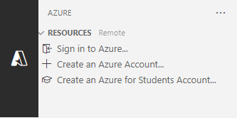

---
lab:
  title: 'Exercício: interaja com uma API mínima do ASP.NET Core'
  module: 'Module: Interact with an ASP.NET Core minimal API'
---

Neste exercício, você executará uma API do ASP.NET Core mínima localmente e explorará a API e o código subjacente. Você também publica a API no Serviço de Aplicativo do Azure. 

Após concluir este exercício, você poderá:

* Navegar em uma API documentada
* Determinar pontos de extremidade para operações HTTP
* Identificar os requisitos de API para operações HTTP
* Publicar o aplicativo no Serviço de Aplicativo do Azure

## Pré-requisitos

Para realizar o exercício, você precisará ter as seguintes ferramentas instaladas no sistema:

* [Visual Studio Code](https://code.visualstudio.com)
* [O SDK mais recente do .NET 8.0](https://dotnet.microsoft.com/download/dotnet/8.0)
* [A extensão do C#](https://marketplace.visualstudio.com/items?itemName=ms-dotnettools.csharp) para Visual Studio Code
* A extensão [Recursos do Azure](https://marketplace.visualstudio.com/items?itemName=ms-azuretools.vscode-azureresourcegroups) para Visual Studio Code.
* A extensão do [Serviço de Aplicativo do Azure](https://marketplace.visualstudio.com/items?itemName=ms-azuretools.vscode-azureappservice) para o Visual Studio Code.
* Uma conta do Azure com uma assinatura ativa. Caso ainda não tenha uma, inscreva-se em uma avaliação gratuita em [https://azure.com/free](https://azure.com/free).

**Tempo estimado para concluir este exercício**: 30 minutos

## Informações da API

A API interage com um banco de dados na memória que contém os seguintes campos:

Campo | Type | Descrição
--- | --- | ---
`id` | Número inteiro | Chave para os dados
`name` | string | Nome da fruta
`instock` | boolean | Indica se a fruta está em estoque

A documentação do Swagger foi criada usando o pacote Swashbuckle.

>**Observação:** os dados de exemplo são criados sempre que a API é iniciada.


## Baixe e execute o código da API Fruit

Nesta seção, você:

* Baixar o código da API
* Executar a API localmente
* Abrir a documentação da API em um navegador

### Tarefa 1: baixar o código da API

1. Clique com o botão direito do mouse no link a seguir e selecione a opção **Salvar link como**. 

    * Código [do projeto FruitAPI](https://raw.githubusercontent.com/MicrosoftLearning/APL-2002-develop-aspnet-core-consumes-api/master/Allfiles/Downloads/FruitAPI.zip)

1. Inicie o **Explorador de Arquivos** e vá até o local em que o arquivo foi salvo.

1. Descompacte o arquivo em sua própria pasta.

#### Tarefa 2: executar a API localmente

1. Inicie o Visual Studio Code e selecione **Arquivo**. Em seguida, clique em **Abrir Pasta...** na barra de menus.

1. Vá até o local onde você descompactou os arquivos de projeto e selecione a pasta *FruitAPI*.

1. A estrutura do projeto no painel **Explorer** deve ser semelhante à captura de tela a seguir. Se o painel **Explorer** não estiver visível, selecione **Visualizar** e, em seguida, selecione **Explorer** na barra de menus.

    

1. Abra um Terminal selecionando **Terminal** e, em seguida, **Novo Terminal** ou use o atalho de teclado **Ctrl+Shift+'**.

1. No painel **Terminal**, execute o seguinte comando `dotnet`:

    ```
    dotnet run
    ```

1. Confira a seguir um exemplo da saída que você verá no painel **Terminal**. Observe a linha `Now listening on: http://localhost:5050` na saída. Ela identifica o host e a porta da API.

    ```
    info: Microsoft.EntityFrameworkCore.Update[30100]
          Saved 3 entities to in-memory store.
    info: Microsoft.Hosting.Lifetime[14]
          Now listening on: http://localhost:5050
    info: Microsoft.Hosting.Lifetime[0]
          Application started. Press Ctrl+C to shut down.
    info: Microsoft.Hosting.Lifetime[0]
          Hosting environment: Development
    info: Microsoft.Hosting.Lifetime[0]
          Content root path: 
          <project location>
    ```

### Tarefa 3: abrir a documentação da API em um navegador

1. Para visualizar a API, você pode inserir `http://localhost:5050` a barra de endereços ou usar **Ctrl + Clique** no link `Now listening on: http://localhost:5050` no **Terminal** mostrado anteriormente. A página exibirá a mensagem "Não foi possível encontrar a página localhost".

1. Acrescente a URL no navegador com `/swagger`. Em geral, o ponto de extremidade `/swagger` é onde você encontrará a documentação de uma API Swagger. A URL completa para a documentação do Swagger é `http://localhost:5050/swagger`. Seu navegador agora deve exibir uma página da web semelhante à captura de tela a seguir:

    

## Executar operações na API

Nesta seção, você:

* Executar várias operações nos dados de exemplo
* Identificar requisitos de ponto de extremidade e dados para operações

### Tarefa 1: executar uma operação `GET`

1. Expanda a operação **GET** com o descritor **Obter todas as frutas** clicando em qualquer lugar na caixa da operação **GET**.

1. Explore as seções da operação e observe as informações mostradas na tabela a seguir.

    | Seção | Descrição |
    |---|--|
    | **Ponto de extremidade** | Mostrado no cabeçalho da operação. O ponto de extremidade é mostrado como `/fruits`. O URI completo é a URL base da API associada com o ponto de extremidade especificado, `http://localhost:5050/fruits` no exemplo. |
    | **Parâmetros** | Nenhum necessário para esta operação. |
    | **Tipo de mídia** | Especifica a codificação do tipo de mídia que a operação retornará. |
    | **Valor de exemplo** | Exibe o esquema dos dados retornados pela operação. Essa operação retorna uma matriz JSON. |

1. Execute a operação selecionando o botão **Experimentar** e, em seguida, **Executar**.

1. A seção **Respostas** da operação foi atualizada com novas informações. Observe o seguinte:

    * **URL de solicitação:** a URL acessada na operação.
    * **Resposta do servidor:** mostra o código de êxito da operação e o **Corpo da resposta** exibe os três registros de exemplo.

### Tarefa 2: executar uma operação `POST`

1. Expanda a operação **POST** com o descritor **Criar nova fruta** clicando em qualquer lugar na caixa da operação **POST**.

1. Explore as seções da operação e observe as informações mostradas na tabela a seguir.

    | Seção | Descrição |
    |---|--|
    | **Ponto de extremidade** | O ponto de extremidade é mostrado como `/fruits`. O URI completo é a URL base da API associada com o ponto de extremidade especificado, `http://localhost:5050/fruits` no exemplo. |
    | **Parâmetros** | Nenhum necessário para esta operação. |
    | **Corpo da solicitação** | O **corpo da solicitação** é necessário, pois a API espera que os dados sejam adicionados à lista e aguarda o tipo de mídia `application/json`. |
    | **Valor de exemplo** | Exibe o esquema dos dados que a API espera receber. |  

1. Para executar a operação, selecione o botão **Experimentar**. 

1. Substitua o JSON na caixa de entrada na seção **Corpo da solicitação** pelo seguinte:

    ```json
    {
        "id": 0,
        "name": "Pear",
        "instock": true
    }
    ```

    >**Observação:** o banco de dados atribuirá seu próprio valor de índice ao adicionar dados, portanto, só precisa haver um valor no campo `id`.

1. A seção **Respostas** da operação foi atualizada com novas informações. Observe o seguinte:

    * **URL de solicitação:** a URL acessada na operação.
    * **Resposta do servidor:** mostra o código de êxito da operação e o **Corpo da resposta** exibe o registro adicionado ao banco de dados.

1. Execute o comando `GET` na seção **Obter todas as frutas** e observe que um registro para *Pêra* foi incluído.

### Tarefa 3: executar uma operação `DELETE`

1. Expanda a operação **DELETE** com o descritor **Excluir fruta por Id** clicando em qualquer lugar na caixa da operação **DELETE**.

1. Explore as seções da operação e observe as informações mostradas na tabela a seguir.

    | Seção | Descrição |
    |---|--|
    | **Ponto de extremidade** | O ponto de extremidade é mostrado como `/fruits/{id}`. O URI completo é a URL base da API associada com o `id` especificado para exclusão. Por exemplo, `http://localhost:5050/fruits/1` aponta para o registro em que `id` é igual a `1`.
    | **Parâmetros** | Requer que o `id` do registro seja passado na URL da solicitação. |

1. Para executar a operação, selecione o botão **Experimentar**. 

1. Exclua o registro de `Apple` nos dados de exemplo inserindo um `1` no campo `id` da seção **Parâmetros** e selecionando **Executar**.

1. A seção **Respostas** da operação foi atualizada com novas informações. Observe o seguinte:

    * **URL de solicitação:** a URL acessada na operação.
    * **Corpo da resposta:** exibe o registro excluído.
    * **Código:** mostra o código de êxito da operação.

1. Execute o comando `GET` na seção **Obter todas as frutas** e observe que o registro da *Maçã* foi excluído.

Quando você estiver pronto para passar para a próxima seção do exercício:

* Feche o navegador e interrompa a API Fruit digitando **Ctrl + C** no terminal em que ela está sendo executada.

## Publicar a API no Serviço de Aplicativo do Azure

Nesta seção, você:

* Usará a extensão Recursos do Azure para se conectar ao Azure
* Usará a extensão do Serviço de Aplicativo do Azure para publicar a API no Serviço de Aplicativo

### Etapa 1: entrar no Azure

1. Selecione a extensão Recursos do Azure para abrir o painel.

    

1. Selecione **Entrar no Azure...**

    Uma janela do navegador solicitará que você entre na sua conta do Azure. Você pode fechar essa janela depois que o processo de entrada for concluído. 

1. Depois de se conectar, a extensão exibirá uma lista de assinaturas disponíveis na conta. Um exemplo é mostrado na captura de tela a seguir.

    

### Tarefa 2: criar um novo aplicativo Web

1. Selecione **Ctrl + Shift + P** para abrir a paleta de comandos, digite **Criar novo aplicativo Web** com o objetivo de filtrar a lista e selecione a opção **Serviço de Aplicativo do Azure: criar novo aplicativo Web... (avançado)**. 

1. Se a conta tiver várias assinaturas, você será solicitado a selecionar a assinatura que deseja usar para a implantação. 

1. Insira um nome globalmente exclusivo para o novo aplicativo Web. Você pode testar `fruitapi-<name>` e substituir `<name>` por seu nome ou iniciais.

1. Selecione **+Criar novo grupo de recursos** e aceite o valor padrão ou insira `fruitapi-rg`.

1. Selecione **.NET 8 (LTS)** na pilha de runtime.

1. Selecione **Linux** como sistema operacional

1. Selecione um local para os novos recursos que esteja perto de você.

1. Selecione **Criar um novo Plano do Serviço de Aplicativo** e aceite o valor padrão ou insira outro nome. 

1. Selecione **Gratuito (F1) Experimente o Azure sem custo** para o tipo de preço.

1. Selecione **Ignorar por enquanto** quando for solicitado a selecionar um novo recurso do Application Insights.

A ferramenta criará os recursos necessários no Azure e compilará o código.

### Tarefa 3: implantar o aplicativo Web e navegar no site em execução

1. Depois que os recursos forem criados e o código tiver concluído a compilação, uma janela aparecerá solicitando que você **Implante**. Selecione a opção **Implantar**. 

    O sistema compilará uma versão de lançamento do código e a implantará nos recursos criados anteriormente.

1. Quando a implantação for concluída, um novo pop-up aparecerá com a opção **Procurar no site**. Em seguida, selecione **Procurar no site**.

1. Na janela do navegador que abrir, talvez seja necessário adicionar `/fruits` no final da URL. Você verá a saída bruta da API mostrando todos os dados.

    >**OBSERVAÇÃO:** a interface do usuário do Swagger está desativada porque está habilitada apenas para ambientes de desenvolvimento. A implantação no Serviço de Aplicativo é considerada um ambiente não de desenvolvimento, a menos que você execute uma configuração adicional.

Parabéns, você implantou com êxito a API no Serviço de Aplicativo do Azure.

>**Observação:** é uma boa prática excluir recursos do Azure que você não precisa mais. Você pode remover todos os recursos criados nesta seção do exercício excluindo o grupo de recursos criado anteriormente no portal do Azure.

## Revisão

Neste exercício você aprendeu a:

* Navegar em uma API documentada
* Determinar pontos de extremidade para operações HTTP
* Identificar os requisitos de API para operações HTTP
* Publicar o aplicativo no Serviço de Aplicativo do Azure 
