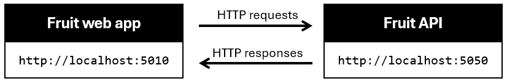

---
lab:
  title: 'Exercício: Renderizar respostas de API em aplicativos Web do ASP.NET Core Blazor'
  module: 'Module: Render API responses in ASP.NET Core Blazor Web apps'
---

Neste exercício, você aprenderá a adicionar um código a um aplicativo Web do ASP.NET Core Blazor para renderizar resultados a partir de operações HTTP. Esse código é adicionado aos arquivos *.razor*. O código que executa as operações nos arquivos *.razor.cs* foi concluído.

## Objetivos

Após concluir este exercício, você será capaz de:

* Implementar a sintaxe Razor em um aplicativo
* Integrar código C# à sintaxe Razor

## Pré-requisitos

Para realizar o exercício, você precisará ter as seguintes ferramentas instaladas no sistema:

* [Visual Studio Code](https://code.visualstudio.com)
* [O SDK mais recente do .NET 8.0](https://dotnet.microsoft.com/download/dotnet/8.0)
* [A extensão do C#](https://marketplace.visualstudio.com/items?itemName=ms-dotnettools.csharp) para Visual Studio Code

**Tempo estimado para concluir este exercício**: 30 minutos

## Cenário do exercício

Este exercício tem dois componentes:

* Um aplicativo Web que envia solicitações HTTP para uma API. O aplicativo é executado em `http://localhost:5010`
* Uma API que responde a solicitações HTTP. A API é executada em `http://localhost:5050`



## Baixar o código

Nesta seção, você baixará o código do aplicativo Web Fruit e da API Fruit. Você também executará a API Fruit localmente para que ela esteja disponível para o aplicativo Web.

### Tarefa 1: baixar e executar o código da API

1. Clique com o botão direito do mouse no link a seguir e selecione a opção **Salvar link como**. 

    * Código [do projeto FruitAPI](https://raw.githubusercontent.com/MicrosoftLearning/APL-2002-develop-aspnet-core-consumes-api/master/Allfiles/Downloads/FruitAPI.zip)

1. Inicie o **Explorador de Arquivos** e vá até o local em que o arquivo foi salvo.

1. Descompacte o arquivo em sua própria pasta.

1. Abra o **Terminal do Windows** ou um **Prompt de Comando** e vá até o local em que você extraiu o código da API.

1. Em uma janela do **Terminal do Windows**, execute o seguinte comando do `dotnet`:

    ```
    dotnet run
    ```

1. Confira a seguir um exemplo do resultado gerado. Observe a linha `Now listening on: http://localhost:5050` na saída. Ela identifica o host e a porta da API.

    ```
    info: Microsoft.EntityFrameworkCore.Update[30100]
          Saved 3 entities to in-memory store.
    info: Microsoft.Hosting.Lifetime[14]
          Now listening on: http://localhost:5050
    info: Microsoft.Hosting.Lifetime[0]
          Application started. Press Ctrl+C to shut down.
    info: Microsoft.Hosting.Lifetime[0]
          Hosting environment: Development
    info: Microsoft.Hosting.Lifetime[0]
          Content root path: 
          <project location>
    ```

>**Observação:** deixe a API Fruit em execução durante todo o resto do exercício. 

### Tarefa 2: baixar e abrir o projeto de aplicativo Web

1. Clique com o botão direito do mouse no link a seguir e selecione a opção **Salvar link como**. 

    * [Código de projeto de renderização do app Web Fruit](https://raw.githubusercontent.com/MicrosoftLearning/APL-2002-develop-aspnet-core-consumes-api/master/Allfiles/Downloads/FruitWebApp-render.zip)

1. Inicie o **Explorador de Arquivos** e vá até o local em que o arquivo foi salvo.

1. Descompacte o arquivo em sua própria pasta.

1. Inicie o Visual Studio Code e selecione **Arquivo**. Em seguida, clique em **Abrir Pasta...** na barra de menus.

1. Vá até o local em que você descompactou os arquivos de projeto e selecione a pasta *FruitWebApp-render*.

1. A estrutura do projeto no painel **Explorer** deve ser semelhante à captura de tela a seguir. Se o painel **Explorer** não estiver visível, selecione **Visualizar** e, em seguida, selecione **Explorer** na barra de menus.

    

>**Observação:** reserve um tempo para revisar o código em cada um dos arquivos editados durante o exercício. O código é muito comentado e pode ajudar você a entender a base do código.

## Implementar código para renderizar dados na home page

O aplicativo Web Fruit exibe os dados de exemplo da API na home page. Você precisa adicionar um código para iterar pelos dados de amostra retornados pela operação `GET` HTTP executada no arquivo code-behind.

### Tarefa 1: adicionar código para renderizar dados em uma tabela

1. Selecione o arquivo *Home.razor* no painel **Explorer** para abri-lo para edição.

1. Adicione o seguinte código entre os comentários `@* Begin render API data code block *@` e `@* End render API data code block *@`.

    ```razor
    <tbody>
        @*  The Razor explicit expression @foreach is used to iterate through the
            data returned to the data model from the HTTP operations. *@
        @foreach (var obj in _fruitList ?? [])
        {
            <tr>
                @* Display the name of the fruit. *@
                <td width="50%">@obj.name</td>
                @*  The following if statment changes the true/false of instock to Yes/No. *@
                @{
                    if (@obj.instock)
                    {
                        <td width="20%" class="text-md-center">
                            Yes
                        </td>
                    }
                    else
                    {
                        <td width="20%" class="text-md-center">
                            No
                        </td>
                    }
                }
                <td width="30%" class="text-center">
                    @* The following div renders the Edit and Delete buttons that pass the Id 
                        to a function that handles the navigation and passes the Id to the page. *@
                    <div class="w-75 btn-group btn-group-sm" role="group" style="text-align:center">
                        <button class="btn btn-primary  mx-2" @onclick="() => EditButton(obj.id)">
                            Edit
                        </button>
                        <button class="btn btn-danger mx-2" @onclick="() => DeleteButton(obj.id)">
                            Delete
                        </button>
                    </div>
                </td>
            </tr>
        }
    </tbody>
    ```

1. Salve as alterações em *Home.razor* e revise os comentários no código.

1. No menu superior do Visual Studio Code, selecione **Executar \| Iniciar depuração** ou selecione **F5**. Depois que o projeto for concluído, uma janela do navegador deve ser iniciada com o aplicativo Web em execução

1. Verifique se a página Índice exibe os dados de exemplo da API.

    >**Observação:** as funções **Adicionar à lista**, **Editar** e **Excluir** não funcionarão até você adicionar um código para elas posteriormente neste exercício.

    >**Observação:** é possível ignorar com segurança o prompt abaixo se aparecer quando você executar o aplicativo.

    

1. Para continuar com o exercício, feche o navegador ou a guia do navegador e, no Visual Studio Code, selecione **Executar \| Parar depuração** ou **Shift + F5**.

## Implementar código para lidar com a funcionalidade **Adicionar à lista**

As operações de adicionar, editar e excluir são tratadas em uma página *.razor* separada no projeto. Nesta seção, você adicionará código para criar um formulário no aquivo *Add.razor* para habilitar a adição de dados à lista.

### Tarefa 1: adicionar código para criar o formulário de adição de dados

1. Selecione o arquivo *Add.razor* no painel **Explorer** para abri-lo para edição.

1. Adicione o seguinte código entre os comentários `@* Begin render Add code block *@` e `@* End render Add code block *@`.

    ```csharp
    @* Data is added using a Razor form, the data model is bound to the form.*@
    <EditForm OnSubmit="Submit" FormName="AddFruit" Model="_fruitList">
        @*  The _fruitList.id is here so the full data model is represented on the page.
            The database behind the API will assign the id. *@
        <InputNumber hidden="true" @bind-Value="_fruitList!.id" />
        <div class="border p-3 mt-4" style="width:50%">
            <div class="row pb-2">
                <h2 class="text-primary pl-3">Add Fruit</h2>
                <hr />
            </div>
            <div class="mb-3">
                <label class="h5"></label><br />
                @* Empty text box for the name of the fruit to be added. *@
                <InputText @bind-Value="_fruitList!.name" />
            </div>
            <div class="mb-3">
                <label class="h5"></label><br />
                @* Render the true/false instock state from the record in an editable checkbox. *@
                <InputCheckbox @bind-Value="_fruitList!.instock" style="width:20px; height:20px" />
                <label class="h7">Check the box if it's available.</label>
            </div>
            @* Submit the addition or return to the Index page if the Add is cancelled.*@
            <button @onclick="() => Submit()" class="btn btn-primary" style="width:150px;">Create</button>
            <a class="btn btn-secondary" style="width:150px;" href="/">Cancel</a>
        </div>
    </EditForm>
    ```
    
1. Salve as alterações em *Add.razor* e revise os comentários no código.

1. No menu superior do Visual Studio Code, selecione **Executar \| Iniciar depuração** ou selecione **F5**. Depois que o projeto for concluído, uma janela do navegador deve ser iniciada com o aplicativo Web em execução

1. Selecione **Adicionar à lista** na página.

1. Digite o nome de uma fruta que você deseja adicionar à lista e marque a caixa de seleção para indicar que ela está disponível.

1. Selecione **Criar** para adicionar a entrada à lista e você será roteado de volta para a página inicial. Verifique se a entrada foi adicionada à lista.

1. Para continuar com o exercício, feche o navegador ou a guia do navegador e, no Visual Studio Code, selecione **Executar \| Parar depuração** ou **Shift + F5**.

## Implementar código para lidar com a funcionalidade **Editar**

Nesta seção você adiciona código para criar um formulário no arquivo *Edit.cshtml* para permitir a edição de dados na lista.

### Tarefa 1: adicionar código ao formulário de edição

1. Selecione o arquivo *Edit.razor* no painel **Explorer** a fim de abri-lo para edição.

1. Adicione o seguinte código entre os comentários `@* Begin render Edit code block *@` e `@* End render Edit code block *@`.

    ```csharp
    @* Data is edited using a Razor form, the data model is bound to the form.*@
    <EditForm OnSubmit="Submit" FormName="EditFruit" Model="_fruitList">
        @*  The id for the data record is hidden because it needs to be available to the 
            code-behind processing, but it's not displayed. *@
        <InputNumber hidden="true" @bind-Value="_fruitList!.id" />
        <div class="border p-3 mt-4" style="width:50%">
            <div class="row pb-2">
                <h2 class="text-primary pl-3">Edit Fruit</h2>
                <hr />
            </div>
            <div class="mb-3">
                <label asp-for="FruitModels.name" class="h5"></label><br/>
                @* Render the name of the fruit in an editable text box. *@
                <InputText @bind-Value="_fruitList!.name" />
            </div>
            <div class="mb-3">
                <label  class="h5"></label><br/>
                @* Render the true/false instock state from the record in an editable checkbox. *@
                <InputCheckbox @bind-Value="_fruitList!.instock" style="width:20px; height:20px" />
                <label class="h7"><i class="bi bi-arrow-left"></i>  Check the box if available.</label>
            </div>
            @* Submit the changes or return to the Index page if the Edit is cancelled.*@
            <button type="submit" class="btn btn-danger " style="width:150px;">Save</button>
            <a class="btn btn-secondary" style="width:150px;" href="/">Cancel</a>
        </div>
    </EditForm>
    ```

1. Salve as alterações em *Edit.razor* e revise os comentários no código.

1. No menu superior do Visual Studio Code, selecione **Executar \| Iniciar depuração** ou selecione **F5**. Depois que o projeto for concluído, uma janela do navegador deve ser iniciada com o aplicativo Web em execução

1. Escolha um item na lista para alterar e selecione **Editar** nessa linha.

1. Edite o nome da fruta e marque a caixa de seleção para alterar o status de disponibilidade.

1. Selecione **Atualizar** para salvar suas alterações e você será encaminhado de volta para a página inicial. Verifique se a alteração é mostrada na lista.

1. Para continuar com o exercício, feche o navegador ou a guia do navegador e, no Visual Studio Code, selecione **Executar \| Parar depuração** ou **Shift + F5**.

## Implementar código para lidar com a funcionalidade **Excluir**

Nesta seção você adiciona código para criar um formulário no arquivo *Delete.cshtml* para permitir a exclusão de dados da lista.

### Tarefa 1: adicionar código para o formulário de exclusão

1. Selecione o arquivo *Delete.razor* no painel **Explorer** para abri-lo para edição.

1. Adicione o seguinte código entre os comentários `@* Begin render Delete code block *@` e `@* End render Delete code block *@`.

    ```csharp
    @* Data is deleted using a Razor form, the data model is bound to the form.*@
    <EditForm OnSubmit="Submit" FormName="DeleteFruit" Model="_fruitList">
        @*  The id for the data record is hidden because it needs to be available to the 
            code-behind processing, but it's not displayed. *@
        <InputNumber hidden="true" @bind-Value="_fruitList!.id" />
        <div class="border p-3 mt-4" style="width:50%">
            <div class="row pb-2">
                <h2 class="text-primary pl-3">Delete Fruit</h2>
                <hr />
            </div>
            <div class="mb-3">
                <label asp-for="FruitModels.name" class="h5"></label><br/>
                @* Render the name of the fruit in a non-editable text box. *@
                <InputText @bind-Value="_fruitList!.name" Disabled/>
            </div>
            <div class="mb-3">
                <label  class="h5"></label><br/>
                @* Render the true/false instock state from the record in a non-editable checkbox. *@
                <InputCheckbox @bind-Value="_fruitList!.instock" style="width:20px; height:20px" Disabled  />
                <label class="h7">Check the box if available.</label>
            </div>
            @* Submit the changes or return to the Index page if the delete is cancelled.*@
            <button type="submit" class="btn btn-danger " style="width:150px;">Delete</button>
            <a class="btn btn-secondary" style="width:150px;" href="/">Cancel</a>
        </div>
    </EditForm>
    ```

1. Salve as alterações em *Delete.razor* e revise os comentários no código.

1. No menu superior do Visual Studio Code, selecione **Executar \| Iniciar depuração** ou selecione **F5**. Depois que o projeto for concluído, uma janela do navegador deve ser iniciada com o aplicativo Web em execução

1. Escolha um item na lista para excluir e selecione **Excluir** nessa linha.

1. Selecione **Excluir** e você será encaminhado para a página inicial. Verifique se o item excluído não aparece mais na lista.

Quando tudo estiver pronto para terminar o exercício:

* Feche o navegador ou a guia do navegador e, no Visual Studio Code, selecione **Executar \| Parar depuração** ou **Shift + F5**. 

* Pare a API Fruit digitando **Ctrl + C** no terminal em que ela está sendo executada.

## Revisão

Neste exercício você aprendeu a:

* Implementar palavras-chave do Razor em um aplicativo
* Integrar um código C# com a sintaxe do Razor Pages
